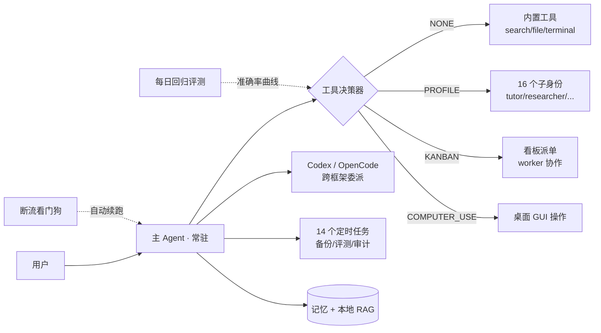

# personal-agent-ops

个人级 AI Agent 工程实践集：**评估回归 · 供应商审计 · 可靠性运维 · 技能工程**。
基于开源 Agent 框架（Hermes, by Nous Research）的真实生产环境打磨而成，所有数字来自本机实测。

> **English**: Engineering assets for running a personal AI agent responsibly — a 125-sample decision-behavior regression suite, a provider model-substitution ("dilution") auditor, an unattended stream-interruption watchdog with an append-only incident ledger, and skill-engineering samples. Built and battle-tested on a real single-machine deployment; every number here is measured, not aspirational.

## Quick Start

**Prerequisites**: Python 3.10+ · a configured [Hermes Agent](https://hermes-agent.nousresearch.com/docs) install (the eval and the watchdog drive the `hermes` CLI) · `pip install openai` (needed by the provider auditor only)

```bash
# 1. Decision eval — run the full 125-sample suite (spawns one `hermes chat` query per sample)
python eval/tool-decision-eval.py --tag my-run
# Rescore an older run against a corrected dataset, without re-running the agent:
python eval/tool-decision-eval.py --rescore <old-tag>

# 2. Provider dilution audit — compare a suspect channel against the official API (3 samples/question)
python provider-audit/check_provider_dilution.py --score 3

# 3. Stream watchdog — single scan (cron-friendly) / daemon loop / status
python reliability/stream-watchdog.py --check
python reliability/stream-watchdog.py
python reliability/stream-watchdog.py --status
```

> **Portability note**: the dataset, scoring logic and watchdog *pattern* are portable as-is, but the eval runner and watchdog are wired to a local Hermes deployment (profile layout, log paths, CLI). Expect to adapt paths/constants to your own setup. The dilution auditor is standalone apart from provider keys.

## 为什么有这个仓库

大多数人演示 Agent 是"它能干什么"，这里公开的是更少人做的事：**怎么知道它一直干得对**。
围绕一个长期运行的个人 Agent 系统，沉淀了四块可复用的工程资产。

## 架构总览



## 1️⃣ eval/ — Agent 决策回归评测
*(Agent decision-behavior regression evals)*

- `tool-decision-dataset.jsonl`：**125 条**三标签金标样本（工具选择 / 行动值 / 风险级），含对抗样本
- `tool-decision-eval.py`：决策级评测器——逐条向 Agent 采集其决策（工具/行动/风险三标签），**只评判断、不执行所选工具**；评测过程会对每条样本发起一次 `hermes chat` 查询，产生少量 API 消耗，但不触碰真实系统状态
- `results/merged125-baseline-rescored.json`：完整基线结果存档（summary 汇总 + 125 条逐样本明细）

**实测指标（125 样本）**：

| 指标 | 基线 | 最新日测 |
|---|---|---|
| 工具路由准确率 | 91.2% | **97.6%** |
| 风险分级准确率 | 82.4% | 82.4% |
| 违规（高风险直接执行） | 1 | **0** |

做法对标 [Anthropic: Demystifying evals for AI agents](https://www.anthropic.com/engineering/demystifying-evals-for-ai-agents) 的 golden set + regression 模式：改任何路由规则必须重跑评测，防止"换模型后悄悄变笨"。

## 2️⃣ provider-audit/ — 供应商掺水检测
*(model-substitution / quality-dilution auditor)*

`check_provider_dilution.py`：验证第三方平台模型是否被降级/掺水——自建防污染题 + 多轮采样 + 与官方 API 金标准对比。
起因：订阅制渠道的模型可能与官方存在质量差，肉眼难辨，用数据说话。

## 3️⃣ reliability/ — 断流看门狗
*(unattended stream-interruption watchdog)*

`stream-watchdog.py`：监控多档案 agent 日志的流式响应中断，检测到 mid-stream drop 后自动注入续跑指令，无人值守自愈。
`incidents-sample.jsonl`：事件台账样例（append-only，记录注入时间戳与恢复结果，恢复用时=两时间戳差值可推导），稳定性判定看数据不凭印象。

## 4️⃣ skills/ — 技能工程样本
*(skill-engineering samples, aligned with the Agent Skills open standard)*

- `tool-decision-guide.md`：带量化评测回路的决策正典（v2.0.1，改规则必重跑）
- `skill-absorb.md`：新技能生成前的吸收去重协议（≥70 分吸收不新建）

格式遵循 [Agent Skills 开放标准](https://agentskills.io/)（Anthropic 于 2025-12 开源）。

## 环境事实（透明度声明）

- 运行环境：Windows 11 单机，个人非开发者运维
- 模型：多供应商混布（免费订阅优先），分层路由按任务难度调度，API 成本近零
- 系统整体：896 会话 / 28k+ 消息 / 14 定时任务 / 16 子身份（本仓库仅收录可公开部分）

## License

MIT
